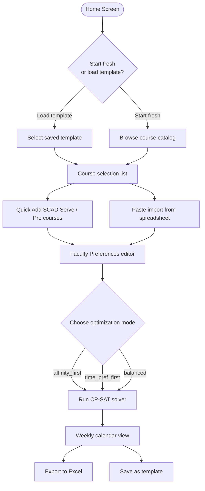
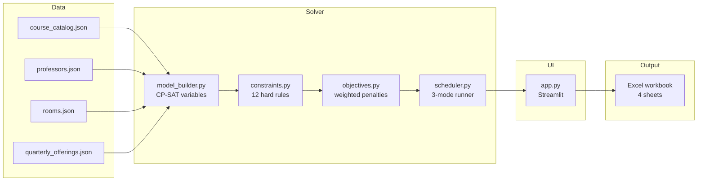

# SCAD GAME Department Course Scheduler

A constraint-solving web app that builds quarterly course schedules for SCAD's Game department. Give it a list of courses to offer — it produces three optimized draft schedules, viewable in a browser and exportable to Excel.

---

## What It Does

The scheduler combines a **Streamlit web interface** with an **OR-Tools CP-SAT constraint solver** to automate the most tedious part of quarterly planning. You pick courses from the catalog (or paste them in from a spreadsheet), set faculty preferences, and the solver generates three schedule options optimized for different priorities — all without double-booking professors, mismatching room types, or blowing past teaching load limits.

---

## Features

- **Template system** — save and reload quarterly offering sets (fall typical, grad focused, summer light, etc.)
- **Faculty preference editor** — set per-professor time preferences and max load directly in the UI
- **Three optimization modes** — `affinity_first`, `time_pref_first`, `balanced`
- **Weekly calendar view** — visual grid of the generated schedule before export
- **Quick Add** — one-click addition of SCAD Serve and Pro courses
- **Paste import** — paste a tab-separated course list from Google Sheets or Excel to bulk-add courses
- **Excel export** — color-coded 4-sheet workbook (Summary + one sheet per schedule option)

---

## Rooms

| Room | Type | Capacity | Notes |
|---|---|---|---|
| 261 | PC Lab | 20 PCs | Standard game lab |
| 263 | PC Lab | 20 PCs | Standard game lab |
| 156 | Large Game Lab | 10 PCs | Larger room, fewer machines |
| 260 | Mac Lab | Mac workstations | Design / motion media |
| Design Studio | Flex | Variable | Layout changes per use |
| Lecture / Zoom | Lecture | Variable | No specialized equipment |

---

## Faculty

Seven professors, each configured with:
- **Available quarters** (sabbatical / leave support)
- **Max teaching load** (chair: 2 courses, standard: 4, overload cap: 5)
- **Time preferences** (morning, afternoon, or no preference)
- **Teaching departments** and **specialization tags** that drive affinity matching

---

## Solver Constraints

### Hard constraints (violations = infeasible)
- Each course section gets exactly one assignment
- No professor teaches two courses at the same time
- No room hosts two courses at the same time
- Professor total load stays within `max_classes`
- `must_have` sections are always scheduled
- Multi-section courses use non-overlapping time slots

### Soft constraints (violations = penalty score)
| Objective | What it penalizes |
|---|---|
| Affinity mismatch | Professor's specialization tags don't align with the course |
| Time preference | Assignment falls outside the professor's preferred time window |
| Overload | Professor exceeds standard load (still legal, but penalized) |
| Dropped sections | `should_have` and `could_have` sections that couldn't be placed |

---

## User Workflow



---

## Data Flow



---

## Setup

### Prerequisites

- Python 3.10 or newer
- pip (included with Python)

### Install

```bash
git clone <repo-url>
cd GAME_Scheduler
pip install -r requirements.txt
```

### Run

```bash
# Windows
run.bat

# Mac / Linux / any terminal
streamlit run app.py
```

The app opens at `http://localhost:8501`.

### CLI mode (batch / headless)

```bash
python main.py --quarter fall
# or offline (skips live catalog scrape):
python main.py --quarter fall --offline
```

---

## File Structure

```
GAME_Scheduler/
├── app.py                      Streamlit web interface (primary entry point)
├── main.py                     CLI entry point for headless / batch runs
├── config.py                   Constants: time slots, penalty weights, room compat, tags
├── requirements.txt            Python dependencies
├── run.bat                     Windows one-click launcher
│
├── data/
│   ├── quarterly_offerings.json   EDIT THIS each quarter — courses to schedule
│   ├── course_catalog.json        Full course catalog (auto-generated by scraper)
│   ├── professors.json            Faculty profiles, availability, time preferences
│   └── rooms.json                 Room inventory with capacities and equipment types
│
├── schemas/                    JSON validation schemas
│   ├── course_catalog.schema.json
│   ├── professor.schema.json
│   ├── quarterly_offering.schema.json
│   └── room.schema.json
│
├── solver/
│   ├── model_builder.py        Loads data, creates CP-SAT model and decision variables
│   ├── constraints.py          Hard constraints HC1–HC12
│   ├── objectives.py           Weighted penalty objective SO1–SO5
│   └── scheduler.py            Runs solver in 3 modes, extracts and returns results
│
├── ingest/
│   ├── catalog_scraper.py      Fetches courses from catalog.scad.edu (with fallback)
│   ├── catalog_defaults.py     Infers room types, specialization tags, prof preferences
│   └── validate.py             Schema + cross-reference validation before each solve
│
├── export/
│   └── excel_writer.py         Writes the 4-sheet color-coded Excel workbook
│
└── templates/                  Saved quarterly offering sets (JSON)
    ├── fall_typical.json
    ├── grad_focused.json
    ├── summer_light.json
    └── full_catalog_preview.json
```

---

## Optimization Modes

| Mode | Affinity weight | Time pref weight | Overload weight |
|---|---|---|---|
| `affinity_first` | 10 | 1 | 2 |
| `time_pref_first` | 1 | 10 | 2 |
| `balanced` | 5 | 5 | 3 |

**Affinity** measures how well a professor's specialization tags match the course's required tags. A lower penalty score means a better match.

---

## Reading the Excel Output

| Sheet | Contents |
|---|---|
| Summary | All three modes side-by-side: status, penalty score, courses placed, unscheduled |
| Affinity First | Full schedule optimized for professor-course fit |
| Time Pref First | Full schedule optimized for professor time preferences |
| Balanced | Even weighting across both objectives |

**Color coding:**
- Blue rows — Game department courses
- Purple rows — Motion Media department courses
- Green rows — AI department courses
- Yellow Affinity cell — professor is in the preferred list for this course
- Orange Time Pref cell — assignment is outside the professor's preferred hours

---

## Current Status

### Phase 2 — Streamlit UI (active)

**Done:**
- Full Streamlit web interface (`app.py`)
- Template save/load system
- Faculty preference editor in the UI
- Weekly calendar view of results
- Quick Add for SCAD Serve and Pro courses
- Paste import from spreadsheets
- All three optimization modes wired to the UI
- Excel export from the web interface
- 119-course catalog (GAME + MOME + AI departments)

**Up next:**
- Side-by-side comparison view of all three schedule options
- Drag-and-drop manual overrides on the calendar
- PDF export option
- Multi-quarter planning view

---

## Troubleshooting

**Validation errors before solving**

```bash
python -m ingest.validate
```

Common causes: typo in a `catalog_id`, professor ID that doesn't exist in `professors.json`, or a quarter mismatch between `quarterly_offerings.json` and the `--quarter` flag.

**INFEASIBLE status**

The solver couldn't place one or more `must_have` sections. Check that the course has at least one eligible professor available that quarter, and that the required room type exists in `rooms.json`.

**Scraper fallback**

If the live scrape of `catalog.scad.edu` fails, the tool uses the built-in 2025–2026 catalog automatically. Add `--offline` to always skip the scrape.

**Excel file won't write**

Close the file in Excel before re-running. The writer overwrites the file on each run.
