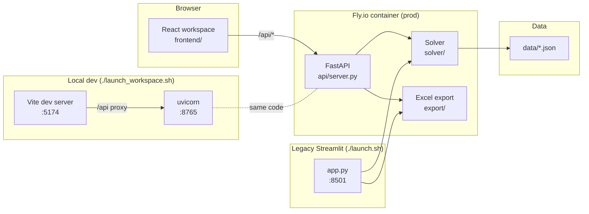

# SCAD GAME Department Course Scheduler

A constraint-solving web app that builds quarterly course schedules for
SCAD's Game department. Drag courses onto a weekly grid, hit **Generate**,
and an OR-Tools CP-SAT solver returns three optimized draft schedules —
exportable to Excel.

**Hosted for faculty:** `https://scad-class-scheduler.fly.dev` (gated by
Cloudflare Access once DNS is wired — see [DEPLOY.md](DEPLOY.md)).

---

## Two surfaces, one solver

The project ships two user interfaces that both talk to the same
OR-Tools CP-SAT solver in [`solver/`](solver/):

### 1. React workspace (primary, hosted)

A three-panel drag-and-drop workspace for quarterly scheduling. This is
what faculty use via the hosted URL.

| Panel | What it does |
|-------|--------------|
| **Roster** (left) | Offerings / Profs / Rooms tabs. Click any row to edit availability and preferences in the detail panel. |
| **Quarter Schedule** (center) | 2×4 weekly grid (MW / TTh × 8am/11am/2pm/5pm). Drag courses onto cells; drag back to the roster to unpin. Click **Generate** to run the solver. |
| **Class / ProfessorCard / RoomCard** (right) | Editor for whichever row is currently selected. |

Served as a static React bundle by the FastAPI container. API lives at
`/api/*`, UI at `/`, same origin.

### 2. Streamlit UI (legacy, parallel)

The original Streamlit app at [`app.py`](app.py) still works. It uses the
same solver and templates; kept alive for Tim's own day-to-day scheduling
until the React workspace reaches feature parity on the admin side
(templates, paste-import, etc.).

Run locally with `./launch.sh` (Mac) or `run.bat` (Windows).

---

## Architecture at a glance



**Data flow for a Generate click (hosted):** React posts the current state
(offerings + prof/room overrides) to `/api/solve` → FastAPI translates via
[`api/adapter.py`](api/adapter.py) → OR-Tools runs 3 modes → results stream
back → React applies the assignments for the currently-selected mode.
Canonical JSON on disk is never mutated by solves.

---

## Rooms & Faculty

Seven real SCAD rooms in Ivy Hall:

| Room | Type | Stations | Displays | Capacity | Notes |
|------|------|----------|----------|----------|-------|
| 263  | PC Lab          | 20 PCs | 2 | 20 | Standard game lab |
| 261  | PC Lab          | 20 PCs | 2 | 20 | Standard game lab |
| 260  | Mac Lab         | 20 Macs | 1 | 20 | Design / motion media |
| 259  | PC Lab          | 20 PCs | 1 | 20 | PC design lab |
| 258  | Lecture/Flex    | teacher station | 1 | 24 | Lecture, discussion, Zoom |
| 257  | Lecture/Flex    | teacher station | 1 | 24 | Lecture, discussion, Zoom |
| 156  | Large Game Lab  | 10 PCs | 1 | 20 | Senior / thesis studio |

Seven professors, each configured with available quarters, max teaching
load (chair: 2, standard: 4, overload cap: 5), time preferences, and
specialization tags that drive affinity matching.

---

## Solver constraints

### Hard (violations = infeasible)
- Each course section gets exactly one assignment
- No professor teaches two courses at the same time
- No room hosts two courses at the same time
- Professor total load stays within `max_classes`
- `must_have` sections are always scheduled
- Multi-section courses use non-overlapping time slots
- Rooms marked `available: false` this quarter are skipped

### Soft (violations = penalty score)
| Objective | What it penalizes |
|-----------|-------------------|
| Affinity mismatch | Prof's specialization tags don't align with the course |
| Time preference | Assignment outside prof's preferred time window |
| Overload | Prof exceeds standard load (still legal, but penalized) |
| Dropped sections | `should_have` / `could_have` sections that couldn't be placed |

Three optimization modes weight these differently — `affinity_first`,
`time_pref_first`, `balanced` — all three run per click so you can compare.

---

## Running locally

### Prerequisites
- Python 3.12+ and pip
- Node.js 20+ and npm (for the React workspace)

### One-shot install
```bash
git clone https://github.com/profangrybeard/GAME_Scheduler.git
cd GAME_Scheduler
pip install -r requirements.txt
(cd frontend && npm ci)
```

### Dev loop — React workspace + FastAPI (primary)
```bash
./launch_workspace.sh          # Mac/Linux
run_workspace.bat              # Windows
```
Opens `http://localhost:5174`. Vite hot-reloads the React workspace;
uvicorn hosts the solver at `127.0.0.1:8765`; Vite proxies `/api/*` so
the dev and prod URL paths match.

### Dev loop — Legacy Streamlit
```bash
./launch.sh                     # Mac/Linux
run.bat                         # Windows
```
Opens `http://localhost:8501`.

### CLI mode (batch / headless)
```bash
python main.py --quarter fall
python main.py --quarter fall --offline    # skips live catalog scrape
```

### Tests
```bash
python -m pytest tests/                     # solver + API adapter tests
(cd frontend && npm run build && npm run lint)
```

---

## Deployment

See [DEPLOY.md](DEPLOY.md). TL;DR:

- `git push origin main` triggers
  [`.github/workflows/fly.yml`](.github/workflows/fly.yml), which runs
  `flyctl deploy --remote-only`
- ~60–90 s later the new version is live at
  `https://scad-class-scheduler.fly.dev`
- The version badge in the top-right shows the deployed commit's SHA

---

## Documentation

- **[DEPLOY.md](DEPLOY.md)** — Fly.io + Cloudflare Access runbook
- **[docs/state-flow.md](docs/state-flow.md)** — React state ownership, panel mapping, offering lifecycle
- **[CLAUDE.md](CLAUDE.md)** — project rules (responsive breakpoints, frontend/backend boundary)
- **[MILESTONES.md](MILESTONES.md)** — historical milestone log

---

## Contributing

This is a solo-maintained project with occasional Claude-assisted sessions.
Pull requests welcome, but practically, the audience is small enough that
opening an issue to discuss before implementing is usually faster.

All PRs run:
- **frontend-ci.yml** — `tsc --build`, Vite build, ESLint
- **python-ci.yml** — pytest
- **fly.yml** — deploys on merge to main (only runs when `FLY_API_TOKEN` secret is set)
