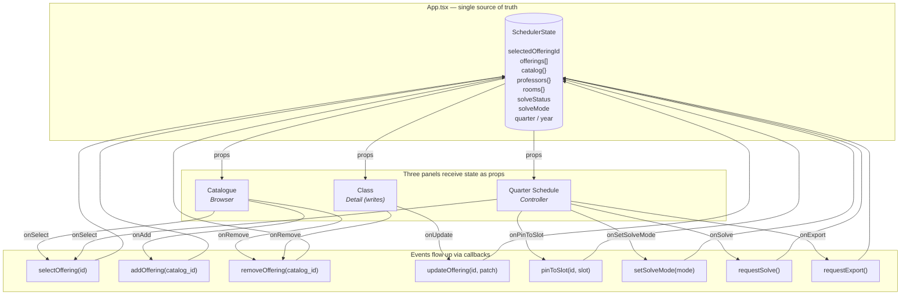

# GAME Scheduler — State Flow

Mermaid diagram showing where state lives and how the three panels
communicate. Satisfies the AI 201 Project 2 rubric requirement (10 pts).

## Panel mapping (Option Y — scheduler's natural flow)

The Reactive Sandbox brief names three roles: **Browser**, **Detail View**,
and **Controller**. This app maps them to the scheduler's real workflow:

| Rubric role      | Panel         | What it does                              |
|------------------|---------------|-------------------------------------------|
| Browser          | **Catalogue** | Pick a course from the full catalog       |
| Detail View*     | **Class** | Assign prof, room, priority, notes — *writes* |
| Controller       | **Quarter Schedule** | Place offerings onto the week, generate, export |

\*See the Record of Resistance section below — this is where we bend the rubric,
deliberately.



## Rules this diagram enforces

1. **Single source of truth.** Exactly one `SchedulerState` object exists. It
   lives in `App.tsx`. Panels receive pieces of it as props. No panel holds
   its own copy of any domain field. (Local UI state like a filter search box
   stays inside the panel — that's not part of SchedulerState.)

2. **Props down.** Data flows one-way from `App` into panels. Panels never
   read from siblings — they only read from props.

3. **Events up.** User actions inside a panel invoke callbacks. The callbacks
   are defined in `App.tsx` and mutate state there. The mutation triggers
   React's render cycle, which updates all three panels with the new props.

## Record of Resistance — Class writes

The rubric describes the Detail View as read-only. The scheduler's natural
workflow is three steps, and the middle one is *authorial*, not inspectorial:

```
Catalogue (pick)  →  Class (assign prof/room/priority)  →  Quarter Schedule (place)
```

If the Class only read, the scheduler would need a fourth panel for
authorial controls — which would break the three-panel constraint. Instead,
Class is a writing Detail View:

- It still obeys **single source of truth**: it never holds domain state, it
  only dispatches `updateOffering`, `removeOffering`.
- It still obeys **events up**: every change round-trips to `App.tsx` before
  any panel re-renders.
- It still obeys **props down**: every field shown is read from props.

What gets bent: the spec's "Detail View only reads" constraint. What stays
intact: the whole point of the lifted-state pattern, which is that state has
exactly one home.

## 4-state offering lifecycle

Each offering passes through four states. The state is derived from its
current fields — no state machine field, just `classifyOffering()` in
`types.ts`:

| State      | `assigned_prof_id` / `assigned_room_id` | `pinned` / `assignment` |
|------------|------------------------------------------|--------------------------|
| Catalogue  | (not in offerings)                       | —                        |
| Offering   | both `null`                              | both `null`              |
| Kitted     | at least one set                         | both `null`              |
| Placed     | any                                      | at least one set         |

Earlier drafts had a separate `Locked` state (both `pinned` and a `locked`
slot set). We collapsed it — `pinned` alone now carries the placement and
drag is always allowed. If the solver eventually needs a hard-constraint
distinction, we can re-introduce it as a boolean flag rather than a
duplicate slot.

## Verification checklist

- [x] Clicking a row in the Catalogue adds it to offerings AND selects it —
      Class populates with the picked course
- [x] Changing priority/prof/room in Class updates SchedulerState (the
      Board card's prof name changes)
- [x] Clicking an empty cell on the Board with a selection pins that
      offering to the slot — the state badge in Class flips to `placed`
- [x] Dragging a placed card back onto the Roster list unpins it
- [x] No field of `SchedulerState` is duplicated anywhere in component state

## Verification log

Append one row every time the checklist is run (manual walkthrough or
automated). Use ✅ for pass, ❌ for fail. If a check fails, add a short
note and open a fix before the next release.

| Date       | Build    | #1 | #2 | #3 | #4 | #5 | Method | Notes |
|------------|----------|----|----|----|----|----|--------|-------|
| 2026-04-17 | c05547b  | ✅ | ✅ | ✅ | ✅ | ✅ | Manual on hosted (`scheduler.autocoursescheduler.com`) via Claude in Chrome | First recorded pass. #5 verified via `rg useState frontend/src/components/` — all 7 matches are local UI state (query, dept, dragOverKey, draggingId, visibleDayGroup, tab, isDragOver). |

